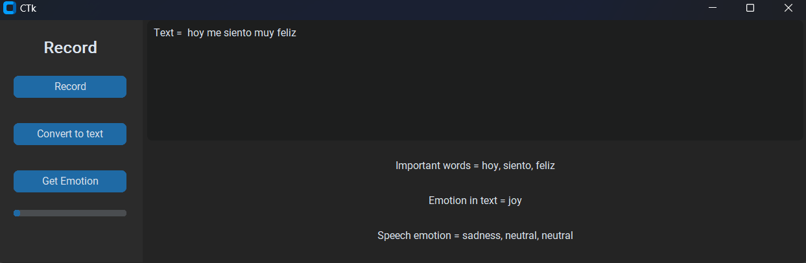
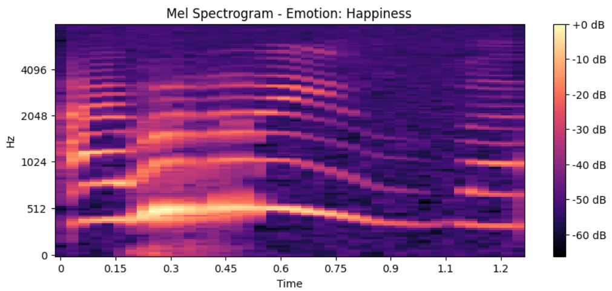
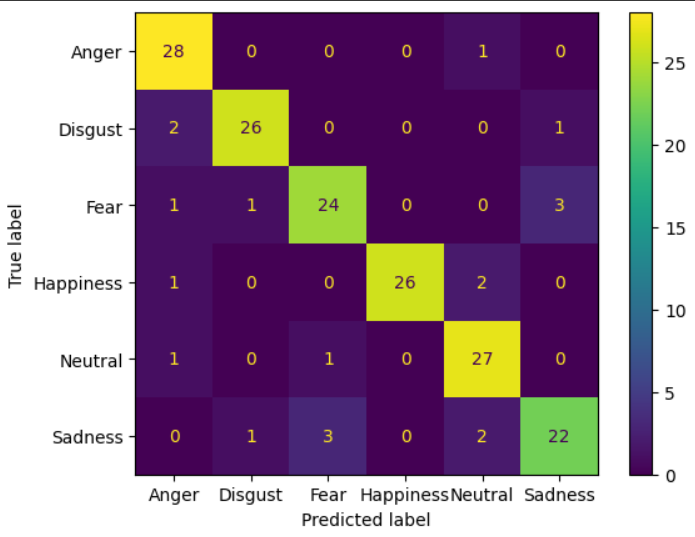

# **Speech and Text Emotion Recognition in Mexican Spanish**

Welcome to the Speech and Text Emotion Recognition in Mexican Spanish project! This system is designed to recognize emotional states from spoken language by processing audio inputs and their corresponding textual representations. My goal is to provide a robust tool for analyzing emotions in Mexican Spanish, catering specifically to the nuances and variations present in the language.

## Overview

The system follows a comprehensive pipeline to capture the emotional tone from both speech and text:

1. **Audio Recording**: Capture audio inputs for processing.
2. **Speech to Text**: Convert the spoken words into written text in Spanish using Whisper.
3. **Keyword Extraction**: Identify and extract key words from the text that are critical for understanding the emotional context.
4. **Audio Segments Extraction**: Retrieve audio segments corresponding to the important words identified in the text.
5. **Speech Emotion Recognition**: Analyze the emotional content of the extracted audio segments using a custom CNN model.
6. **Text Emotion Recognition**: Assess the emotional tone of the complete text using state-of-the-art models.

## Technologies and Models

This project leverages cutting-edge technologies and models to ensure accurate emotion recognition:

- **Whisper**: Utilized for the speech-to-text conversion, providing a solid foundation for accurate text transcription in Spanish.
- **Pysentimiento**: Employed for text emotion recognition, this model is tailored to understand the subtleties of emotional expressions in text.
- **Custom CNN Model**: Developed specifically for this project, my CNN model analyzes the emotional content in audio segments. The model is trained on the Mexican Spanish Emotion Speech Database (MESD), which includes spoken words from children and adults across a range of emotions: anger, disgust, fear, happiness, neutral, and sadness.

## 2D CNN for SER

The core of my emotion recognition system is a 2D Convolutional Neural Network (CNN) designed to analyze the emotional content in audio segments. This section delves into the workings of our CNN, detailing the preparation of input data and the structure of the network, followed by the presentation of performance metrics.

**Data Preparation**
Before feeding the audio data into the CNN, we undergo a meticulous preparation process to ensure the data is conducive to accurate emotion recognition:

1. **Normalization of Audio Duration**: All audio clips are trimmed or padded to ensure uniform length. This standardization is crucial for maintaining consistency across the dataset and ensuring that each input to the CNN is of the same dimension.
2. **Data Augmentation**: To enhance the robustness of our model and to increase the diversity of our training data, we apply three primary augmentation techniques:
* Pitch Shifting: Modifying the pitch of the audio clips without altering their duration, to simulate different vocal tones.
* Adding Noise: Incorporating background noise to the audio clips to improve the model's ability to recognize emotions in less-than-ideal acoustic environments.
* Speed Variation: Adjusting the speed of the audio playback, speeding up or slowing down without changing the pitch, to mimic different rates of speech.

After these preprocessing steps, we convert the audio clips into Mel Spectrograms.

**Performance**

Test accuracy: 88.44

F1 Score: 0.8842

Confusion matrix:

## Usage

You will find two files: **"ser_ter_s2t.py"** and **"ter_t2s.py"**. The first one is the complete system, and the second one is a Text Emotion Recognition that is described in detail in this [repository](https://github.com/alxmares/ter_pysentimiento/edit/master/README.md)

To use the system, follow these steps:

1. Record an audio file in Mexican Spanish.
2. Run the speech-to-text model to transcribe the audio.
3. Extract key words and their corresponding audio segments.
4. Perform emotion recognition on both the audio segments and the complete text.

## Contributing

I welcome contributions from the community! If you'd like to contribute, please fork the repository and create a pull request with your changes. For major changes, please open an issue first to discuss what you would like to change.

## License

## Acknowledgments

- Whisper for speech-to-text conversion
- Pysentimiento for text emotion recognition
- I like to thank Duville, Alonso-Valerdi and Ibarra-zarate for their dedication of the collection of the Mexican Emotional Speech Database *Duville, M.M.; Alonso-Valerdi, L.M.; Ibarra-Zarate, D.I. Mexican Emotional Speech Database Based on Semantic, Frequency, Familiarity, Concreteness, and Cultural Shaping of Affective Prosody. Data 2021, 6, 130.*

Thank you for exploring our Speech and Text Emotion Recognition in Mexican Spanish project. We hope it serves as a valuable tool for your research or application in understanding and analyzing emotions in Mexican Spanish.
